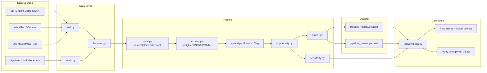

# Architecture



## Module Layout

```
src/market_predictor/
├── config.py           # config.yaml loader
├── cli.py              # CLI entry point
├── data/
│   ├── mock.py         # synthetic VIIRS + grid districts
│   ├── real.py         # NOAA VIIRS, OSM, WorldPop, census tracts
│   └── features.py     # income, roads, competitors, delivery radius
├── pipeline/
│   ├── zonal.py        # vectorized zonal statistics
│   ├── scoring.py      # weighted, MCDA, PCA, XGBoost
│   ├── spatial.py      # Moran's I, spatial lag
│   ├── opportunity.py  # untapped zone detection
│   ├── sensitivity.py  # weight sweep analysis
│   └── runner.py       # orchestration + persistence
└── dashboard/
    └── app.py          # Streamlit UI
```
